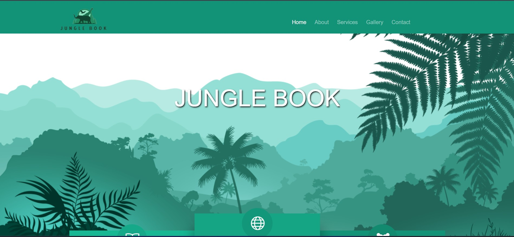
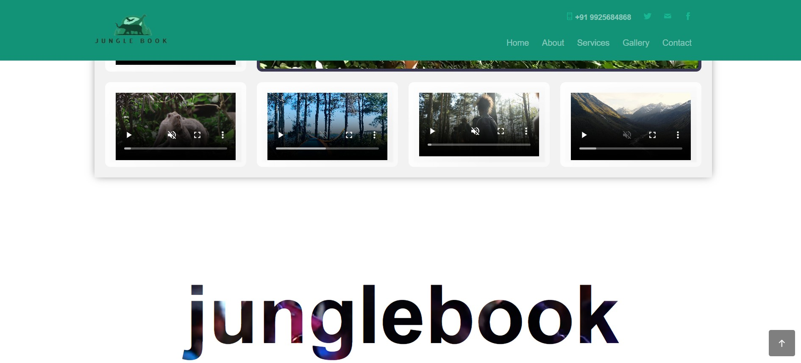

# Jungle Book

Jungle Book is a PHP/MySQL website for an environmental and wildlife-focused non-governmental organization. The project presents the organization, its forest education work, environmental social work, tribal initiatives, gallery, contact forms, and visitor services through a responsive web interface.

## Project Preview






The remaining project media is stored locally and excluded from Git because of repository size. A deployment package or object storage bucket should provide the rest of `public/images/` and `public/video/`.

## Features

- Responsive public website with a forest-inspired visual design
- Home, about, services, education, social work, tribal, gallery, and contact pages
- Service registration and contact forms
- Wildlife, gallery, and environmental information pages
- Ticket and camping booking workflows
- Admin dashboard for managing content, animals, gallery images, tickets, bookings, volunteers, and reports
- MySQL-backed PHP forms and administrative records

## Technology

- PHP
- MySQL
- HTML5 and CSS3
- Bootstrap
- JavaScript and jQuery
- Animate.css, Owl Carousel, Magnific Popup, Icomoon, Themify Icons, and ScrollReveal

## Project Structure

```text
.
├── app/                   # Application configuration and services
├── database/              # Schema and database documentation
├── docs/                  # Architecture and operational documentation
├── public/                # Web root and public entry points
│   ├── admin/             # Admin dashboard and content management
│   ├── cards/             # Card pages and assets
│   ├── css/               # Stylesheets
│   ├── images/            # Local media assets
│   ├── js/                # JavaScript assets
│   ├── video/             # Local video assets
│   └── *.php              # Public pages and forms
├── .env.example           # Local configuration template
└── README.md
```

The maintainable architecture and migration boundary are documented in [docs/ARCHITECTURE.md](docs/ARCHITECTURE.md). New database and application code should use `app/` instead of adding more root-level page scripts.

## Requirements

- PHP 7.4 or newer with the MySQLi extension
- MySQL or MariaDB
- Apache, XAMPP, WAMP, or another PHP-compatible web server
- A database named `junglebook`

## Local Setup

1. Clone or copy the project into your web server document root.
2. Create a MySQL database named `junglebook`.
3. Import the project database schema and seed data if available.
4. Copy `.env.example` to `.env` and set the local database values.
5. Start Apache and MySQL.
6. Configure Apache or XAMPP to use `public/` as the document root, then open:

   ```text
   http://localhost/index.php
   ```

The admin area is available at:

```text
http://localhost/admin/index.php
```

## Configuration Notes

- Keep database credentials outside version control for production deployments.
- The public site and admin area share one connection implementation through compatibility wrappers.
- Uploaded admin images are stored in `public/admin/images/`.
- Email and OTP-related forms may require SMTP configuration before they work outside a local environment.

## Credits

This project uses open-source front-end libraries including Bootstrap, jQuery, Animate.css, Owl Carousel, Magnific Popup, Icomoon, Themify Icons, and ScrollReveal. Check the relevant vendor files and project history for their individual license terms.